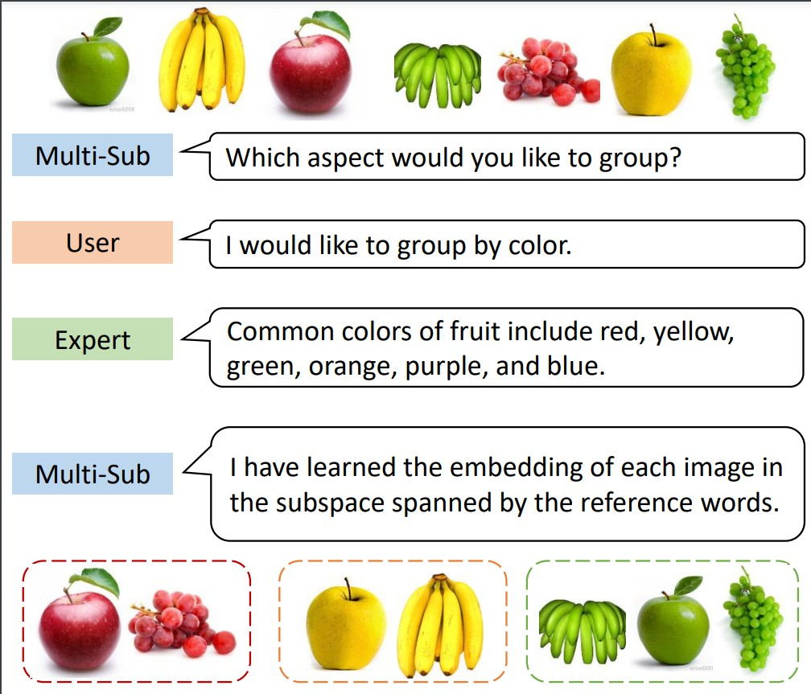

<div align='center'>

# Customized Multiple Clustering via Multi-Modal Subspace Proxy Learning

NeurIPS 2024

[Jiawei Yao](https://alexander-yao.github.io/), [Qi Qian](https://scholar.google.com/citations?user=Rp_40_gAAAAJ&hl=en&oi=ao), [Juhua Hu](http://faculty.washington.edu/juhuah/)*
</div>

|  | 
|:--:| 
| ***The flow chart of Multi-Sub**: Multi-Sub obtains a desired clustering based on the subspace spanned by reference words provided by GPT-4 using users' high-level interest.* |


## Folder Structure

The project is organized as follows:

```bash
.
├── clip/                  
├── dataset/               # Contains datasets for training and evaluation
│   ├── fruit/             # Specific dataset for 'fruit'
│   │   ├── color/         # Sub-dataset for fruit color
│   │   ├── instance/      # Sub-dataset for fruit instances
│   │   └── species/       # Sub-dataset for fruit species
│   ├── cifar10/           # Specific dataset for CIFAR-10
│   │   ├── type/          # Sub-dataset for CIFAR-10 type clustering (e.g., transportation, animals)
│   │   └── environment/   # Sub-dataset for CIFAR-10 environment clustering (e.g., land, air, water)
├── gpt.py                 # Implementation related to GPT
├── main.py                # Main script to run training and evaluation
├── parse.py               # Argument parsing for command-line execution
├── README.md              # This README file
├── requirements.txt       # Dependencies required for running the project
└── setup.py               # Installation setup
```


## Requirements
To run this project, ensure you have the following dependencies installed:
```python
pip install -r requirements.txt
```

## Datasets
Please refer to http://faculty.washington.edu/juhuah/images/AugDMC_datasets.zip

## Training and evaluation
```python
python main.py
```

## Bibtex
Please cite our paper if you use this code in your own work:
```


```
